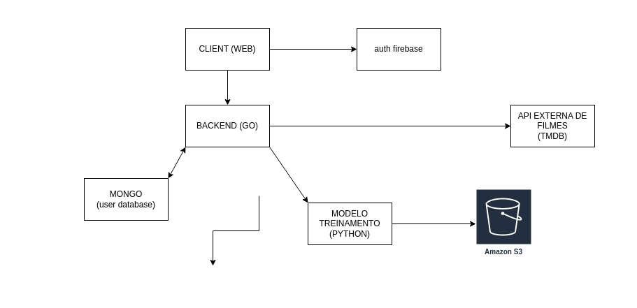

# THE MOVIE BAKERY BACKEND

## SOME STUFF TO ADD

- [x] mongodb
- [ ] gin
- [ ] JWT

## SOME STUFF TODO

### USER CREATION

- [x] CREATE USER
- [x] SHOW USER
- [x] EDIT USER (?)
- [x] DELETE USER

## SOME REQUIREMENTS (esboço não oficial)

### Recuperação de senha

  **Requisitos Funcionais**

  - O usuário deve poder recuperar sua senha informando seu e-mail;
  - O usuário deve receber um e-mail com instruções de recuperação de senha;
  - O usuário deve poder resetar sua senha.

  **Requisitos Não Funcionais**

  - Utilizar Mailtrap para testar envios de de e-mail em ambiente de dev;
  - Utilizar Amazon SES para envios em produção;
  - O envio de e-mails deve acontecer em segundo plano (background-job).

  **Regras de Negócio**

  - O link enviado por e-mail para resetar a senha deve expirar em 2h;
  - O usuário precisa confirmar a nova senha ao resetar sua senha;

### Feedback do usuário EXPLÍCITO

  **Requisitos Funcionais**

  - O usuário poderá dar a opinião dele como gostei ou não gostei de determinado filme ou série;
  - O usuário poderá procurar um filme específico na lista de filmes, utilizando uma barra de pesquisa;
  - Até que o usuário tenha um modelo de preferência formado, o sistema deve mostrar alguns filmes e séries genéricos, a lista é baseada numa nota dos filmes;

  **Requisitos Não Funcionais**

  ?

  **Regras de Negócio**

  - Para acessar a listagem de filmes o usuário deverá estar logado;
  - A barra de pesquisa deverá utilizar um algoritmo para relacionar os itens entre si;

## ARCHTECTURE

